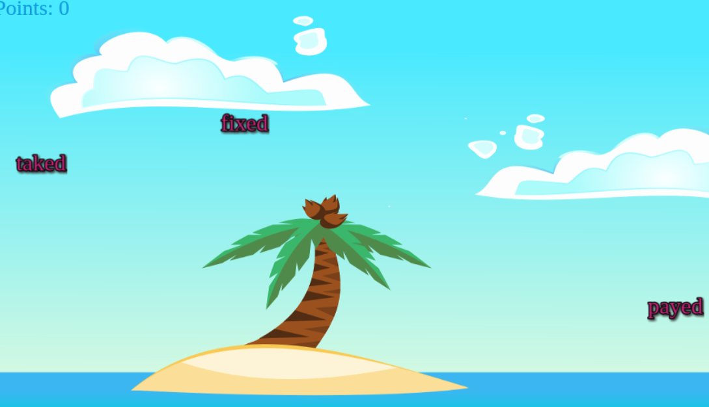

# Touchwords



Touchwords is a visual game for practising irregular past-tense verb forms. Select an incorrectly regularised verb to earn points, but avoid genuine regular verbs or you will lose a heart. Each level ends with a timed correction round.

## Development

The project requires Node.js 20.19 or newer.

```sh
npm ci
npm run dev
```

Useful checks:

```sh
npm run lint
npm test
npm run build
```

`npm run build` creates the deployable static site in `dist/`. The generated service worker makes the built game available offline after its first successful load.

For a deployment below a URL prefix, keep using `BUILD_TARGET_URL_PATH`:

```sh
BUILD_TARGET_URL_PATH=/touchwords/ npm run build
```

## Structure

- `src/game/` contains framework-independent game state, random selection, and word movement.
- `src/screens/` contains the individual UI screens.
- `src/data/levels.js` exposes the existing level data from `js/levels.json`.
- `src/styles.css` owns responsive layout and device-specific input hints.
- `tests/` covers scoring, lives, progression, and random selection.
